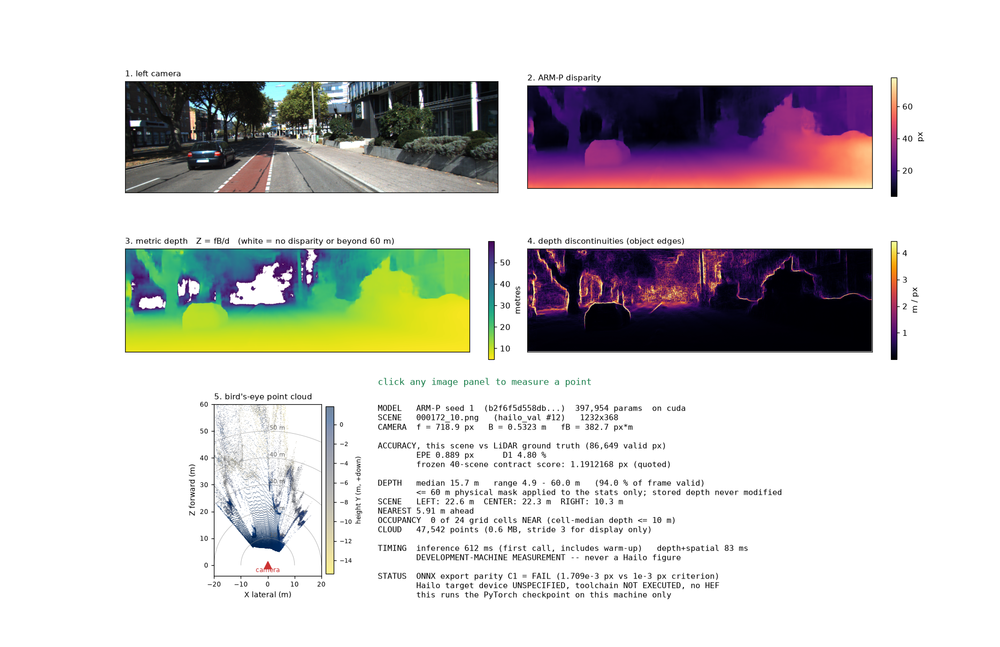
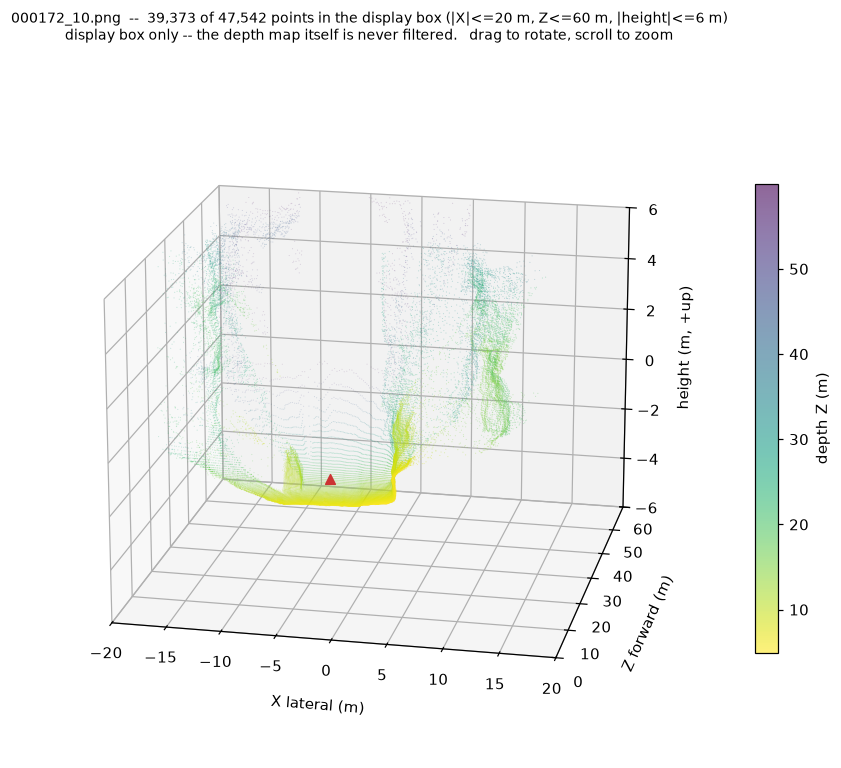
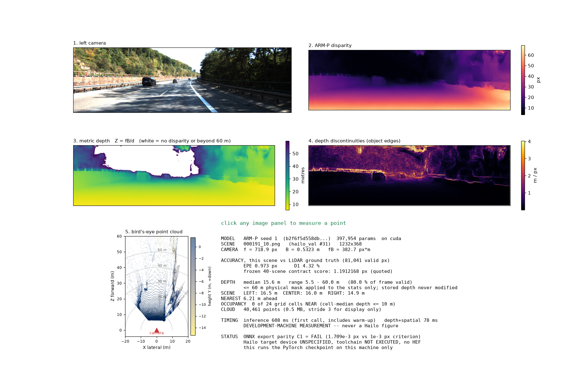

# Stereo Depth Vision — Microchip StereoNet

A small stereo-depth network for edge silicon, developed against a frozen evaluation contract,
and the complete record of how it was built, what it achieves, and where it stopped.

**Status: technical investigation CLOSED. Hailo deployment BLOCKED — the target device has
never been specified.**

| | |
|---|---|
| Frozen model | **ARM-P seed 1** — 397,954 parameters |
| Accuracy | **1.1912168 px** EPE on the frozen 40-scene KITTI contract (reference model: 1.3134471 px) |
| Perception stack | metric depth, point cloud, occupancy, depth edges — **405 checks, 0 failures** |
| Known failures | ONNX export parity **FAIL** · activation-rescale **FAIL** (both frozen, unrepaired) |
| Hailo | target device **UNSPECIFIED** · toolchain **NOT EXECUTED** · **no HEF exists** |

> ARM-P seed 1 is the frozen deployment candidate selected under C0, but deployment to Hailo
> has **not** occurred because the target Hailo device has not been specified and the
> corresponding target toolchain has therefore not been executed.

---

## What it does

One stereo pair in; disparity, metric depth, a point cloud, occupancy and object edges out.
Click any panel in the demo to measure that point in metres.



The same point cloud in 3D — rotatable and zoomable. Road surface in yellow, the two building
facades either side, camera at the origin in red.



A highway scene from the same 40-scene validation split:



---

## Quick start

```bash
pip install -r requirements.txt          # Python 3.12

# KITTI 2015 stereo is NOT in this repo. Download data_scene_flow.zip (~1.6 GB) and
# data_scene_flow_calib.zip from the KITTI benchmark site and extract to data/kitti2015/
# so that training/{image_2,image_3,disp_occ_0,calib_cam_to_cam} exist.

python stage_c_deploy/demo/pipeline_demo.py --cloud3d        # see it run
python stage_c_deploy/demo/pipeline_demo.py --list           # the 40 validation scenes
```

Every frozen number in this repository was produced with torch 2.7.0+cu128, onnx 1.22.0,
onnxruntime 1.27.0 and numpy 2.5.1; `requirements.txt` pins torch and torchvision only.

Demo details: [`stage_c_deploy/demo/README.md`](stage_c_deploy/demo/README.md).
Exact dataset layout: [`phase0/docs/BASELINE_CONTRACT.md`](phase0/docs/BASELINE_CONTRACT.md).

---

## The pipeline

Input geometry is KITTI 368×1232 throughout. **Exactly one stage is neural.**

| # | Stage | Implementation | Validated by |
|---|---|---|---|
| 1 | Load + preprocess stereo pair | `src/datasets/kitti2015.py` | frozen contract |
| 2 | **ARM-P inference → disparity** | `stage_c_deploy/metric_depth/armp_depth.py` | EPE 1.1912168 px |
| 3 | Metric depth, `Z = fB/d` | `stage_c_deploy/metric_depth/` | **C2 — 135/135 PASS** |
| 4 | Point cloud, spatial cells, occupancy | `stage_c_deploy/spatial_perception/` | **C2.1 — 251/251 PASS** |
| 5 | Depth discontinuities (object edges) | `stage_c_deploy/spatial_perception/discontinuity.py` | **C2.1.1 — 19/19 PASS** |

Stages 3–5 are deterministic host code. They add no neural model, they never modify the stored
depth, and they say nothing about Hailo hardware.

---

## Results

| Model | Frozen-contract EPE | Note |
|---|---|---|
| Hailo reference ONNX | 1.3134471 px | the model this project is measured against |
| **ARM-P seed 1** | **1.1912168 px** | the frozen deployment candidate |
| ARM-P seeds 0 / 2 | 1.2057590 / 1.1996447 px | same recipe, other seeds |
| Random-init control | 1.4440242 px (seed 1) | identical recipe, no pretraining |
| P2A seed 0 | 1.4149796 px | previous candidate; 3-seed mean 1.4409826 px |
| Starting PyTorch baseline | 15.3958267 px | where the project began |

The contract: KITTI 2015, `hailo_val` scenes 160–199, `disp_occ_0`, 368×1232, GT 1/256,
**3,802,797 valid pixels**, pooled. It was never edited to improve a number.

**What this does and does not mean.** ARM-P recorded a lower frozen-contract EPE than the
random-init control in all six seed×selection cells, and lower than the historical controlled
reference figure. It does **not** establish universal superiority, statistical significance,
that SceneFlow pretraining is the causal mechanism, generalization beyond this split, or any
hardware benefit. Full bounds: [`stage_b_armp/ARMP_CLOSURE_RECORD.md`](stage_b_armp/ARMP_CLOSURE_RECORD.md) §§11–13.

---

## What failed, what is unknown, what is blocked

**Failed** — frozen, preserved, not repaired:

- **C1 export parity: FAIL.** ARM-P ONNX vs PyTorch max abs diff **0.001708984375 px** against
  the frozen **1e-3 px** criterion. Five export variants (opset 11/13/17 × constant folding)
  produce bit-identical outputs, so no export-level fix was found in the tested space.
- **DR-1 activation rescale: H1 FAIL.** Dividing the aggregated cost by 1e17 changes disparity
  by up to **1.4816284e-02 px**, fifteen times the equivalence threshold. Rejected, not adopted.

**Unknown** — measured, but the outcome cannot be predicted from here:

- ARM-P carries extremely large fp32 intermediates (~1e18 vs the reference's ~1e1–1e2).
  Whether they survive target-native int8 quantization is **UNKNOWN**; no threshold exists and
  none was invented. Dynamic range does **not** explain the C1 failure.
- Coverage-vs-pretraining and true group-wise correlation are **NOT IDENTIFIABLE** on this
  platform. GWC itself is **OPEN BUT UNSUPPORTED — not refuted**.

**Blocked** — needs an answer from outside this repository:

- The **Hailo target device is unspecified**. No company requirement for device, board,
  SDK/DFC version, resolution, FPS, power or quantization mode exists anywhere here.
  Hailo-8 / 10H / 15H references under `reference/` are **historical** and must never be
  promoted to "the target".
- Therefore: no parse, no quantization, no compile, **no HEF**, no latency, no power figure.
  The only `.hef` in the repo is the historical `reference/stereonet.hef`.

To unblock, someone must answer the 14 fields in
[`stage_c_deploy/STAGE_C_DEPLOYMENT_READINESS_FINAL.md`](stage_c_deploy/STAGE_C_DEPLOYMENT_READINESS_FINAL.md) §17.

---

## Reproducing the numbers

`phase1/harness/frozen_eval.py` is the contract itself — a library, not a script. The runnable
entry points:

```bash
# ARM-P seed 1, full 40-scene contract          -> EPE 1.191216765057325
python stage_c_deploy/dr1_rescale/dr1_eval_40scene.py

# the three P2A checkpoints                     -> seed 0 EPE 1.4149796
python phase2/scripts/eval_p2a.py

# Stage-B scoring, 4 checkpoints (ARM-P + control, best + final)
python stage_b_armp/20260919T012646Z_tier2_seed1/scripts/eval_tier2.py

# the device-independent gates                  -> 135/135, 251/251, 19/19
python stage_c_deploy/metric_depth/validate_c2.py
python stage_c_deploy/spatial_perception/validate_spatial.py
python stage_c_deploy/spatial_perception/validate_discontinuity.py
```

Any deviation means the contract or the environment differs — investigate before trusting the
number. Re-running ARM-P Stage 1 pretraining additionally needs SceneFlow (~160 GB of
archives); acquisition notes in [`phase1/docs/SCENEFLOW_ACQUISITION.md`](phase1/docs/SCENEFLOW_ACQUISITION.md).

### Models in this repository

Verify the SHA-256 before use — the full table is [`RESULTS_INDEX.md`](RESULTS_INDEX.md) §11.

| File | What |
|---|---|
| `stage_b_armp/20260919T012646Z_tier2_seed1/armp/p2a_best.pth` | **the deployment candidate** (`b2f6f5d5…`) |
| `…/tier2_seed1/control/p2a_best.pth`, `…/{armp,control}/p2a_final.pth` | control arm and both final-epoch checkpoints |
| `stage_b_armp/20260918T062146Z_stage1_pretrain/checkpoints/armp_stage1_best.pth` | the SceneFlow-pretrained initialization |
| `phase2/runs/p2a_scale_coverage{,_s1,_s2}/p2a_best.pth` | P2A seeds 0/1/2 |
| `stage_c_deploy/armp_stereonet.onnx`, `…_static.onnx` | ARM-P exports — **C1 parity FAIL** |
| `phase2/deploy/p2a_stereonet.onnx` | P2A export — parity PASS |
| `reference/onnx/stereonet.onnx` | the Hailo reference model |

**Not shipped:** the datasets, the 774 MB per-pixel raw dumps, the repacked KITTI upload
bundle, rendered scene PNGs, the vendor `reference/upstream` and `reference/public_repos`
clones, the profiler HTML, the DEBUG and export-variant graphs, and `reference/stereonet.hef`.
All are regenerable from the shipped code, and every number cited from them lives in the
JSON/CSV records that *are* shipped. Vendor hashes: `reference/MANIFEST.md`.

---

## Repository map

| Path | Contents |
|---|---|
| **[`RESULTS_INDEX.md`](RESULTS_INDEX.md)** | **start here** — every phase, stage, run and audit with status, source and purpose, plus a reader-hazard list |
| `phase0/` | baseline lock: the frozen contract and the reference baseline |
| `phase1/` | reference forensics and the ARM campaign (incumbent ARM-V, 1.7727436 px) |
| `phase2/` | two lines: the P2A optimization + export, and the superseded correspondence campaign |
| `stage_a_diagnostics/` | D0–D7 gap diagnosis; architecture gate **NO ARCHITECTURE JUSTIFIED** |
| `stage_b_armp/` | the ARM-P pretraining intervention, three seeds + environment control, and its closure record |
| `stage_c_deploy/` | export, C1 parity, dynamic range, DR-1, the C2 family, target/toolchain audit, the demo, and both whole-system audits |
| `src/`, `scripts/`, `tests/` | model, datasets, geometry, metrics; per-experiment scripts; 101 tests |
| `docs/` | Phase-1 knowledge base, the demo figures, and the historical Phase-1 README |
| `reference/` | vendor artifacts, hashed in `reference/MANIFEST.md`, mostly downloaded rather than committed |
| `experiments/`, `results/` | immutable Phase-1 experiment records and derived tables |

---

## How this project was run

- The **frozen evaluation contract is authoritative** and is never edited to make a number look
  better.
- **No run directory, checkpoint or record is ever overwritten.** A regression is recorded as a
  regression; a failed gate stays failed.
- **One primary intervention per experiment**, each with a preregistered hypothesis, frozen
  variables, and success *and* rejection criteria written before the run.
- Claims are graded and kept apart: measured / inferred / unknown / not identifiable. "Not
  identifiable" never becomes "false"; "unsupported" never becomes "refuted".
- Hailo's published figures are never presented as ours, and our development-machine timings
  are never presented as Hailo silicon performance.

Full operating rules: [`CLAUDE.md`](CLAUDE.md).

---

## Closure records

| Document | What it is |
|---|---|
| [`stage_c_deploy/FINAL_WHOLE_SYSTEM_AUDIT.md`](stage_c_deploy/FINAL_WHOLE_SYSTEM_AUDIT.md) | independent whole-project audit — verdict: closed, with documentation discrepancies |
| [`stage_c_deploy/FINAL_WHOLE_SYSTEM_AUDIT_SECOND_PASS.md`](stage_c_deploy/FINAL_WHOLE_SYSTEM_AUDIT_SECOND_PASS.md) | a second, independent pass concurring with the first |
| [`stage_c_deploy/DOCUMENTATION_CLOSURE_RECORD.md`](stage_c_deploy/DOCUMENTATION_CLOSURE_RECORD.md) | what the documentation pass changed, and what it deliberately did not |
| [`stage_b_armp/ARMP_CLOSURE_RECORD.md`](stage_b_armp/ARMP_CLOSURE_RECORD.md) | the authoritative Stage-B record, including everything ARM-P does **not** establish |
| [`docs/README_PHASE1_HISTORICAL.md`](docs/README_PHASE1_HISTORICAL.md) | the original Phase-1 README, preserved unedited — it describes the project as of 2026-09-05 and is **not** current |

Earlier phase reports (`PHASE_1_FINAL_REPORT.md`, `PHASE_2_FINAL_REPORT.md`) are historical.
`PHASE_2_FINAL_REPORT.md` still calls P2A "deployed" in its Phase-2 sense and carries a
supersession notice; the current candidate is ARM-P seed 1 and nothing is deployed.
`phase1/results/LEADERBOARD.md` is the historical Phase-1 arm table, not a current index.
